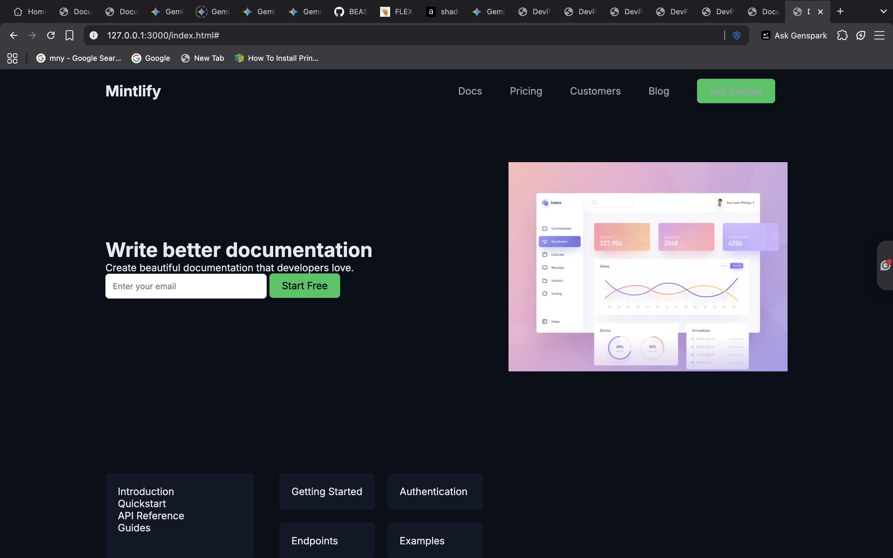
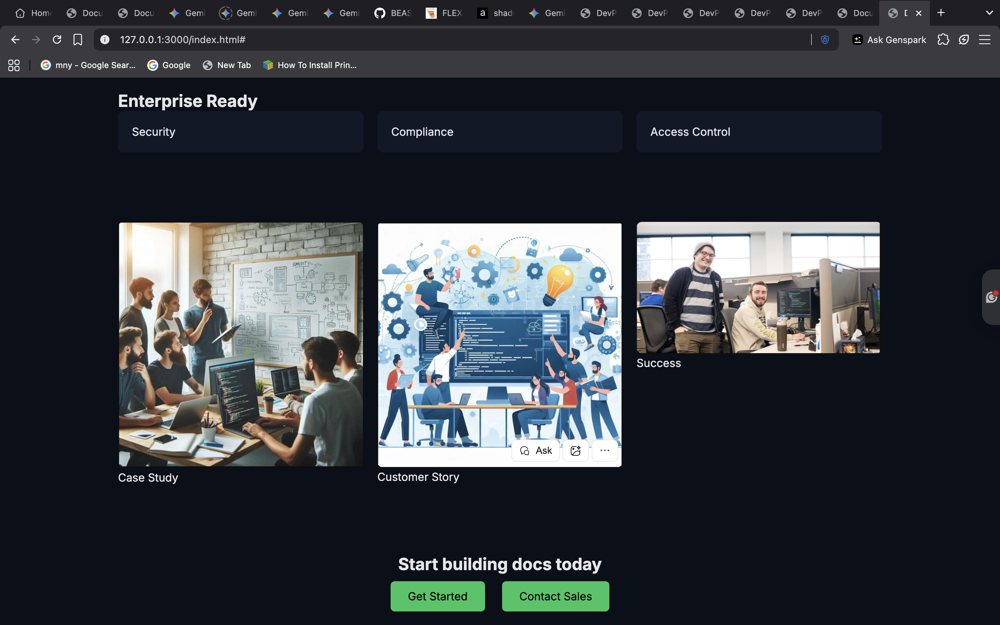

# Mintlify Documentation Style Website

This project is a desktop-first documentation-style website inspired by the Mintlify documentation platform.

## Sections Recreated

The following sections were recreated in this project:

- Top Navigation Bar
- Hero Section with Email Input
- Documentation Preview Section
- Trusted By Logos Section
- Feature Highlights Section
- Intelligent Assistant UI Preview
- Enterprise Features Section
- Case Studies Section
- Final Call-To-Action Section
- Footer Section

## Technologies Used

- HTML5
- CSS3
- Flexbox
- CSS Grid

No JavaScript or frameworks were used as per assignment instructions.

## Fonts Used

- Inter (Google Fonts)

## Color Scheme Used

| Element | Color Code |
|--------|-------------|
| Background | #0b0f19 |
| Card Background | #111827 |
| Text Color | #e5e7eb |
| Secondary Text | #9ca3af |
| CTA Button | #22c55e |

## Website Screenshot

---

## Live Website Link

You can view the hosted version of the documentation website here:

https://beastxchaitanya.github.io/mintlify-docs-clone-/

## Author

Chaitanya Pal  
